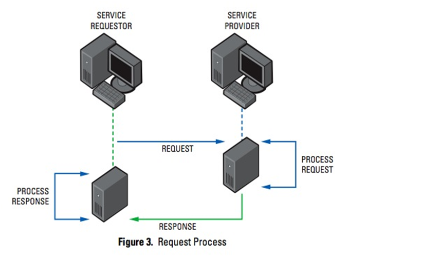
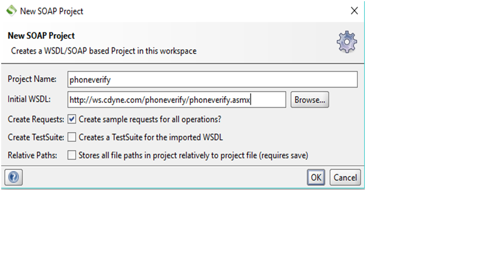
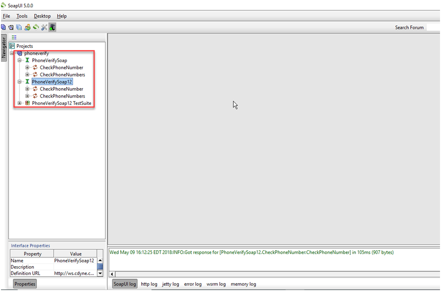
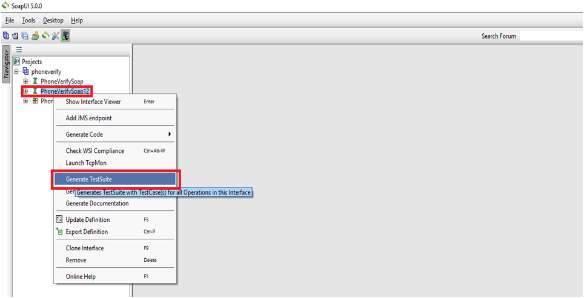
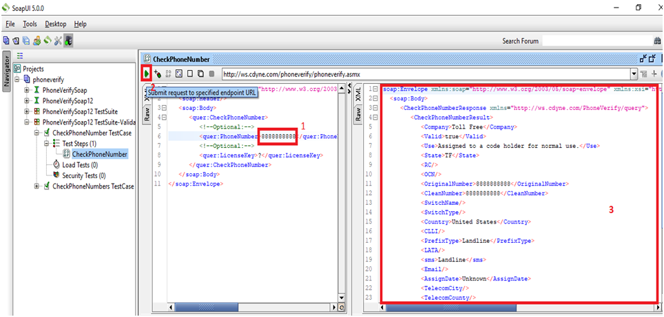
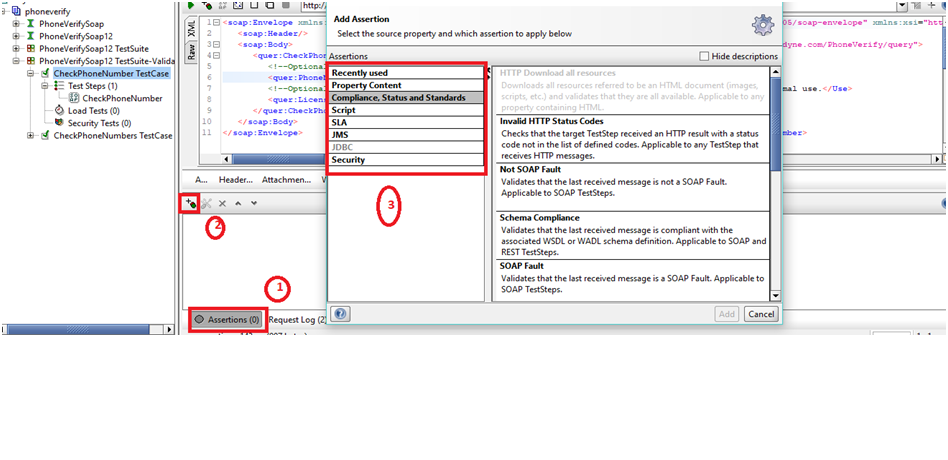
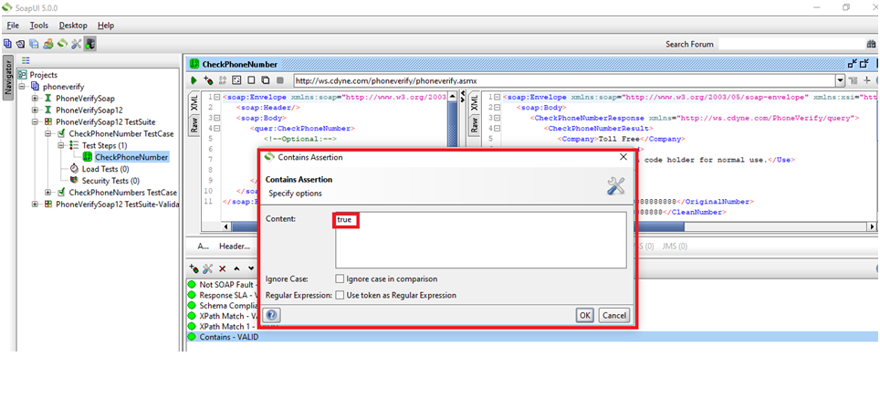
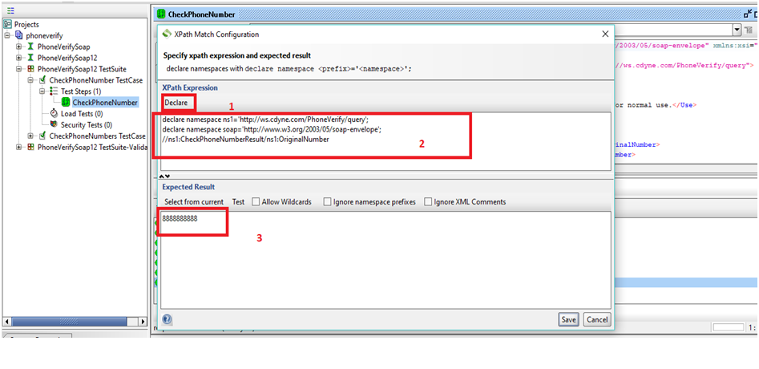

# Web-Service Assertions with SoapUI - Open Source Platform!
Now we are in world of micro-services where everything is gets connected with different APIs which will make easy to do communications between systems and because of they are loosely coupled, they are also easy to maintain in future. Micro-services architecture is becoming very popular and preferred way among architects and developers to creating enterprise applications. Because of it is scalable, this is ideal candidate when there is need to enable support for a number of platforms and devices - Ranging from web, mobile, Internet of Things(IoT), and wearable. There are difference between SOA and Micro-services architectures, this article not intended to provide benefits of one over another. This article is more focus on how we can validate and automate APIs and web services with help of SoapUI open source version, and utilize the assertions more effectively.
## Let&#39;s start with What is Web Service or API?
As per below diagram, Web services are loosely-coupled containers of application functionality. Web Services allow applications to communicate directly with each other. As per below diagram you can see that there is SERVICE REQUESTOR who sends the request and there is SERVICE PROVIDER who accepts the request, process it as per defined rules and provide back processed response toSERVICE REQUESTOR.Web services allow applications to exchange data, and it communicates primarily XML based markup language.

## Tools used:
## SoapUI - Open source 
SoapUI is most common and popular web service tool in the industry, it provides GUI to test functionalities that does not have GUI interface. Open Source version is good for automation validation but need Pro version to get more versatility and simplicity to get automation faster. it can be downloaded from below URL.
https://www.soapui.org/downloads/soapui.html
once it is downloaded then install it with default settings.
## Create project in SoapUI:
Open SoapUI and and go to File > New SOAP Project and enter below wsdl url in "initial WSDL:" field, it will automatically fill "Project Name"
http://ws.cdyne.com/phoneverify/phoneverify.asmx

Now click on "OK" button, and then you will see below two highlighted interfaces are generated automatically which are ready to consume for validation and assertions.

## Generate Test Suite from interface in SoapUI:
Now right click on "PhoneVerfiySoap12" interface and click on "Generate TestSuite" option as per below diagram. it will generate a TestSuite with test cases for all operations which were selected while generating TestSuite.

## Run a Test Case while passing data into request:
Now run a simple request and make sure that it gets some response back by passing some phone number into "PhoneNumber" tag in request as per below, <quer:PhoneNumber><8888888888/quer:PhoneNumber> Then Submit request by clicking green play button which is located on left corner of request. Then you should see some response back from passing appropriate request data.

## Add Assertions to validate Resonse:
Now we can add assertions to make sure that response we got is as per expected. SoapUI equipped with already defined assertions which are easy to configured and integrate within Testcases. We will add few assertions in our SoapUI test and see how we can see them getting passed as we executes the tests.
Below assertions are inbuilt and can be used directly within test cases:

1.	Not SOAP Fault: This assertion validates that the last received message is not a SOAP fault.
2.	Schema Compliance: This assertion validates that the last received message is compliant with the associated WSDL or WADL schema defintion.
3.	Sensitive Information Exposure: Checks that the last received message does not expose an sensitive information about the target system. Applicable to REST, SOAP and HTTP TestSteps.
Add above all assertions by going into assertions(0) tab lower bottom in SoapUI request window and then clicking on "+" symbol, on upper left corner of Request window, that will open the seperate dialog window which will have all available assertions.

Now add Response SLA assertion by going into "SLA" section of Assertions dialog box as per above figure.
4.	Response SLA: This assertion validates that the last received response time was within the defined limit.

Now add contain assertion, by going into "Property Content" section of Assertions dialog box as per below figure. and add the what the response should contain when it runs the request run time. like in this example it should contains 'true' as per below.
5.	Contains: This assertion searches for the existence of a string token in the property value,  supports regular expression.

Now add XPath assertion, by going into "Property Content" section of Assertions dialog box as per below figure, XPath is very useful assertion while validating XML, to add it properly - First click on "Declare" button which will automatically generates namespace for soap and interface. now write the specific XPath of the XML tag which you would like to validate. As per example, we wanted to validate that in response Original Number  should come as "8888888888" which we have passed in Request previously.
6.	XPath: This assertion uses the XPath expression to select content from the target property and compares the result to an expected value. Applicable to any property containing XML.

